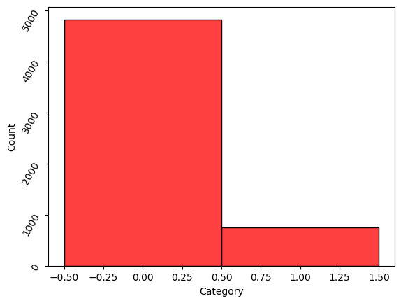
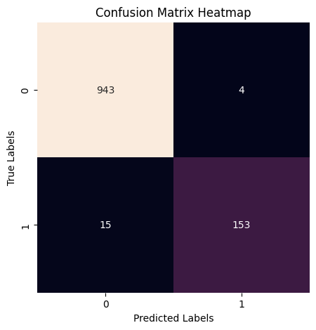
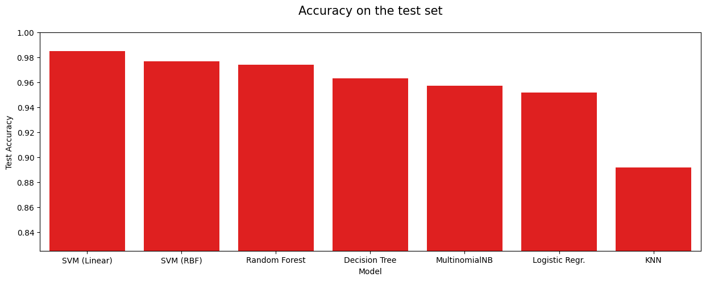
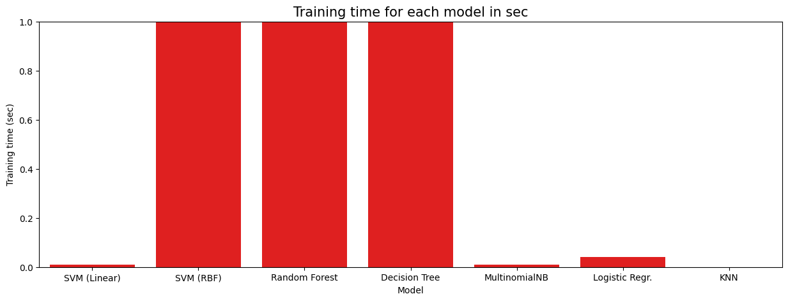

.. code:: ipython3

    import pandas as pd  # For data manipulation and analysis
    import numpy as np  # For numerical operations
    import seaborn as sns  # For data visualization
    import matplotlib.pyplot as plt  # For plotting graphs
    
    from sklearn.feature_extraction.text import TfidfVectorizer  # For converting text data to numerical data
    from sklearn.naive_bayes import MultinomialNB 

.. code:: ipython3

    full_data = pd.read_csv('Email_Data.csv')

.. code:: ipython3

    full_data.shape

.. parsed-literal::

    (5572, 3)

.. code:: ipython3

    full_data.head()

.. raw:: html

    

    
    <table border="1" class="dataframe">
      <thead>
        <tr style="text-align: right;">
          <th></th>
          <th>Label</th>
          <th>Message</th>
          <th>Category</th>
        </tr>
      </thead>
      <tbody>
        <tr>
          <th>0</th>
          <td>ham</td>
          <td>Go until jurong point, crazy.. Available only ...</td>
          <td>0</td>
        </tr>
        <tr>
          <th>1</th>
          <td>ham</td>
          <td>Ok lar... Joking wif u oni...</td>
          <td>0</td>
        </tr>
        <tr>
          <th>2</th>
          <td>spam</td>
          <td>Free entry in 2 a wkly comp to win FA Cup fina...</td>
          <td>1</td>
        </tr>
        <tr>
          <th>3</th>
          <td>ham</td>
          <td>U dun say so early hor... U c already then say...</td>
          <td>0</td>
        </tr>
        <tr>
          <th>4</th>
          <td>ham</td>
          <td>Nah I don't think he goes to usf, he lives aro...</td>
          <td>0</td>
        </tr>
      </tbody>
    </table>
    

.. code:: ipython3

    full_data.Category.value_counts()

.. parsed-literal::

    Category
    0    4825
    1     747
    Name: count, dtype: int64

.. code:: ipython3

    full_data['Category'] = full_data['Category'].astype('category')

.. code:: ipython3

    full_data.info()
         

.. parsed-literal::

    <class 'pandas.core.frame.DataFrame'>
    RangeIndex: 5572 entries, 0 to 5571
    Data columns (total 3 columns):
     #   Column    Non-Null Count  Dtype   
    ---  ------    --------------  -----   
     0   Label     5572 non-null   object  
     1   Message   5572 non-null   object  
     2   Category  5572 non-null   category
    dtypes: category(1), object(2)
    memory usage: 92.8+ KB
    

.. code:: ipython3

    sns.histplot(data=full_data, x=full_data['Category'], color='red')
    
    # Rotating the y-axis labels by 60 degrees for better readability
    plt.yticks(rotation=60)

.. parsed-literal::

    (array([   0., 1000., 2000., 3000., 4000., 5000., 6000.]),
     [Text(0, 0.0, '0'),
      Text(0, 1000.0, '1000'),
      Text(0, 2000.0, '2000'),
      Text(0, 3000.0, '3000'),
      Text(0, 4000.0, '4000'),
      Text(0, 5000.0, '5000'),
      Text(0, 6000.0, '6000')])

.. code:: ipython3

    full_data.isna().sum()
    # checking the missing value

.. parsed-literal::

    Label       0
    Message     0
    Category    0
    dtype: int64

.. code:: ipython3

    full_data.drop_duplicates()

.. raw:: html

    

    
    <table border="1" class="dataframe">
      <thead>
        <tr style="text-align: right;">
          <th></th>
          <th>Label</th>
          <th>Message</th>
          <th>Category</th>
        </tr>
      </thead>
      <tbody>
        <tr>
          <th>0</th>
          <td>ham</td>
          <td>Go until jurong point, crazy.. Available only ...</td>
          <td>0</td>
        </tr>
        <tr>
          <th>1</th>
          <td>ham</td>
          <td>Ok lar... Joking wif u oni...</td>
          <td>0</td>
        </tr>
        <tr>
          <th>2</th>
          <td>spam</td>
          <td>Free entry in 2 a wkly comp to win FA Cup fina...</td>
          <td>1</td>
        </tr>
        <tr>
          <th>3</th>
          <td>ham</td>
          <td>U dun say so early hor... U c already then say...</td>
          <td>0</td>
        </tr>
        <tr>
          <th>4</th>
          <td>ham</td>
          <td>Nah I don't think he goes to usf, he lives aro...</td>
          <td>0</td>
        </tr>
        <tr>
          <th>...</th>
          <td>...</td>
          <td>...</td>
          <td>...</td>
        </tr>
        <tr>
          <th>5567</th>
          <td>spam</td>
          <td>This is the 2nd time we have tried 2 contact u...</td>
          <td>1</td>
        </tr>
        <tr>
          <th>5568</th>
          <td>ham</td>
          <td>Will ü b going to esplanade fr home?</td>
          <td>0</td>
        </tr>
        <tr>
          <th>5569</th>
          <td>ham</td>
          <td>Pity, * was in mood for that. So...any other s...</td>
          <td>0</td>
        </tr>
        <tr>
          <th>5570</th>
          <td>ham</td>
          <td>The guy did some bitching but I acted like i'd...</td>
          <td>0</td>
        </tr>
        <tr>
          <th>5571</th>
          <td>ham</td>
          <td>Rofl. Its true to its name</td>
          <td>0</td>
        </tr>
      </tbody>
    </table>
    
5157 rows × 3 columns

    

.. code:: ipython3

    
    full_data.shape

.. parsed-literal::

    (5572, 3)

.. code:: ipython3

    x = full_data['Message']
    
    # Assigning the 'Category' column of 'full_data' to the variable y
    y = full_data['Category']

.. code:: ipython3

    from sklearn.model_selection import train_test_split
    x_train, x_test, y_train, y_test = train_test_split(x, y, test_size=0.2, random_state=4)
    

.. code:: ipython3

    print(x.shape)
    
    # Printing the shape of the training data for features
    print("x train ", x_train.shape)
    
    # Printing the shape of the testing data for features
    print("x_test", x_test.shape)
    
    # Printing the shape of the training data for target labels
    print("y_train", y_train.shape)
    
    # Printing the shape of the testing data for target labels
    print("y test", y_test.shape)

.. parsed-literal::

    (5572,)
    x train  (4457,)
    x_test (1115,)
    y_train (4457,)
    y test (1115,)
    

.. code:: ipython3

    vectorizer = TfidfVectorizer(stop_words='english', max_df=0.6, lowercase=True)
    
    # Transforming the training data 'x_train' into TF-IDF features #Term Frequency-Inverse Document Frequency
    x_train_tfidf = vectorizer.fit_transform(x_train)
    
    # Transforming the testing data 'x_test' into TF-IDF features
    x_test_tfidf = vectorizer.transform(x_test)
    
    # Converting the data type of 'y_train' and 'y_test' to integer
    y_train = y_train.astype('int')
    y_test = y_test.astype('int')

.. code:: ipython3

    x_train

.. parsed-literal::

    1457    U sleeping now.. Or you going to take? Haha.. ...
    472     How long has it been since you screamed, princ...
    2481    Urgent! call 09066612661 from landline. Your c...
    243     Okay. No no, just shining on. That was meant t...
    1413    Wen ur lovable bcums angry wid u, dnt take it ...
                                  ...                        
    3671                        Ok thanx... Take care then...
    709     To review and KEEP the fantastic Nokia N-Gage ...
    2487           I dont thnk its a wrong calling between us
    174     Bloody hell, cant believe you forgot my surnam...
    1146    Thank you, winner notified by sms. Good Luck! ...
    Name: Message, Length: 4457, dtype: object

.. code:: ipython3

    x_train_tfidf

.. parsed-literal::

    <4457x7488 sparse matrix of type '<class 'numpy.float64'>'
    	with 34613 stored elements in Compressed Sparse Row format>

.. code:: ipython3

    mnb_model = MultinomialNB(alpha=0.1)
    
    # Fitting the Multinomial Naive Bayes classifier to the training TF-IDF features and target labels
    mnb_model.fit(x_train_tfidf, y_train)

.. raw:: html

    

<pre>MultinomialNB(alpha=0.1)</pre><b>In a Jupyter environment, please rerun this cell to show the HTML representation or trust the notebook.  On GitHub, the HTML representation is unable to render, please try loading this page with nbviewer.org.</b>

<input class="sk-toggleable__control sk-hidden--visually" id="sk-estimator-id-1" type="checkbox" checked><label for="sk-estimator-id-1" class="sk-toggleable__label sk-toggleable__label-arrow">MultinomialNB</label>
<pre>MultinomialNB(alpha=0.1)</pre>

.. code:: ipython3

    from sklearn.ensemble import RandomForestClassifier
    from sklearn.naive_bayes import MultinomialNB
    from sklearn.linear_model import LogisticRegression
    from sklearn.neighbors import KNeighborsClassifier
    from sklearn.tree import DecisionTreeClassifier
    from sklearn.svm import LinearSVC, SVC
    from time import perf_counter
    import warnings
    
    # Suppressing warnings for cleaner output
    warnings.filterwarnings(action='ignore')
    
    # Dictionary to hold different models and their performance times
    models = {
        "Random Forest": {"model": RandomForestClassifier(), "perf": 0},
        "MultinomialNB": {"model": MultinomialNB(), "perf": 0},
        "Logistic Regr.": {"model": LogisticRegression(solver='liblinear', penalty='l2', C=1.0), "perf": 0},
        "KNN": {"model": KNeighborsClassifier(), "perf": 0},
        "Decision Tree": {"model": DecisionTreeClassifier(), "perf": 0},
        "SVM (Linear)": {"model": LinearSVC(), "perf": 0},
        "SVM (RBF)": {"model": SVC(), "perf": 0}
    }
    
    # Looping through each model in the dictionary
    for name, model in models.items():
        # Start time
        start = perf_counter()
    
        # Fitting the model to the training data
        model['model'].fit(x_train_tfidf, y_train)
    
        # End time
        duration = perf_counter() - start
        duration = round(duration, 2)
    
        # Storing the duration in the dictionary
        model["perf"] = duration
    
        # Printing the name of the model and the time taken to train
        print(f"{name:20} trained in {duration} sec")

.. parsed-literal::

    Random Forest        trained in 7.73 sec
    MultinomialNB        trained in 0.01 sec
    Logistic Regr.       trained in 0.04 sec
    KNN                  trained in 0.0 sec
    Decision Tree        trained in 1.58 sec
    SVM (Linear)         trained in 0.01 sec
    SVM (RBF)            trained in 2.34 sec
    

.. code:: ipython3

    from sklearn.metrics import classification_report, confusion_matrix, ConfusionMatrixDisplay
    
    # Making predictions on the testing data using the trained Multinomial Naive Bayes model
    y_pred = mnb_model.predict(x_test_tfidf)
    
    # Generating the classification report
    class_report = classification_report(y_test, y_pred)
    
    # Printing the classification report
    print("Classification Report:\n", class_report)
    

.. parsed-literal::

    Classification Report:
                   precision    recall  f1-score   support
    
               0       0.98      1.00      0.99       947
               1       0.97      0.91      0.94       168
    
        accuracy                           0.98      1115
       macro avg       0.98      0.95      0.97      1115
    weighted avg       0.98      0.98      0.98      1115
    
    

.. code:: ipython3

    con_mat = confusion_matrix(y_test, y_pred)
    
    # Creating a figure for the heatmap
    plt.figure(figsize=(5, 5))
    
    # Plotting the heatmap of the confusion matrix with annotations
    sns.heatmap(con_mat, annot=True, fmt='d', cbar=False)
    
    # Adding labels to the x-axis and y-axis
    plt.xlabel('Predicted Labels')
    plt.ylabel('True Labels')
    
    # Adding title to the heatmap
    plt.title('Confusion Matrix Heatmap')

.. parsed-literal::

    Text(0.5, 1.0, 'Confusion Matrix Heatmap')

.. code:: ipython3

    test_dtv = vectorizer.transform(x_test)
    
    # Converting the TF-IDF features to array format
    test_dtv = test_dtv.toarray()
    
    # Printing the number of observations and tokens in the test data
    print(f"Number of Observations: {test_dtv.shape[0]}\nTokens: {test_dtv.shape[1]}")
    
    # Initializing an empty list to store model accuracy and training time
    models_accuracy = []
    
    # Looping through each model in the dictionary
    for name, model in models.items():
        # Calculating the test accuracy of the model
        test_accuracy = model["model"].score(test_dtv, y_test)
    
        # Appending model name, test accuracy, and training time to the list
        models_accuracy.append([name, test_accuracy, model["perf"]])
    
    # Creating a DataFrame from the list of model accuracies
    df_accuracy = pd.DataFrame(models_accuracy)
    
    # Naming the columns of the DataFrame
    df_accuracy.columns = ['Model', 'Test Accuracy', 'Training time (sec)']
    
    # Sorting the DataFrame by test accuracy in descending order
    df_accuracy.sort_values(by='Test Accuracy', ascending=False, inplace=True)
    
    # Resetting the index of the DataFrame
    df_accuracy.reset_index(drop=True, inplace=True)
    
    # Displaying the DataFrame
    df_accuracy

.. parsed-literal::

    Number of Observations: 1115
    Tokens: 7488
    

.. raw:: html

    

    
    <table border="1" class="dataframe">
      <thead>
        <tr style="text-align: right;">
          <th></th>
          <th>Model</th>
          <th>Test Accuracy</th>
          <th>Training time (sec)</th>
        </tr>
      </thead>
      <tbody>
        <tr>
          <th>0</th>
          <td>SVM (Linear)</td>
          <td>0.984753</td>
          <td>0.01</td>
        </tr>
        <tr>
          <th>1</th>
          <td>SVM (RBF)</td>
          <td>0.976682</td>
          <td>2.34</td>
        </tr>
        <tr>
          <th>2</th>
          <td>Random Forest</td>
          <td>0.973991</td>
          <td>7.73</td>
        </tr>
        <tr>
          <th>3</th>
          <td>Decision Tree</td>
          <td>0.963229</td>
          <td>1.58</td>
        </tr>
        <tr>
          <th>4</th>
          <td>MultinomialNB</td>
          <td>0.956951</td>
          <td>0.01</td>
        </tr>
        <tr>
          <th>5</th>
          <td>Logistic Regr.</td>
          <td>0.951570</td>
          <td>0.04</td>
        </tr>
        <tr>
          <th>6</th>
          <td>KNN</td>
          <td>0.891480</td>
          <td>0.00</td>
        </tr>
      </tbody>
    </table>
    

.. code:: ipython3

    plt.figure(figsize=(15, 5))
    sns.barplot(x='Model', y='Test Accuracy', data=df_accuracy, color='r')
    
    # Adding title to the plot
    plt.title('Accuracy on the test set\n', fontsize=15)
    
    # Setting y-axis limits
    plt.ylim(0.825, 1)
    
    plt.show()

.. code:: ipython3

    plt.figure(figsize=(15, 5))
    sns.barplot(x='Model', y='Training time (sec)', data=df_accuracy, color='r')
    
    # Adding title to the plot
    plt.title('Training time for each model in sec', fontsize=15)
    
    # Setting y-axis limits
    plt.ylim(0, 1)
    
    # Displaying the plot
    plt.show()

.. code:: ipython3

    input_email = ['Fine if thatÂ’s the way u feel. ThatÂ’s the way its gota b']
    
    # Transforming the input email into TF-IDF features using the trained vectorizer
    vectorizer_input = vectorizer.transform(input_email)
    
    # Making a prediction using the trained Multinomial Naive Bayes model
    prediction = mnb_model.predict(vectorizer_input)
    
    print(prediction)
    
    if (prediction[0] == 1):
        print('Spam Email')
    else:
        print('Ham Email')

.. parsed-literal::

    [0]
    Ham Email
    

